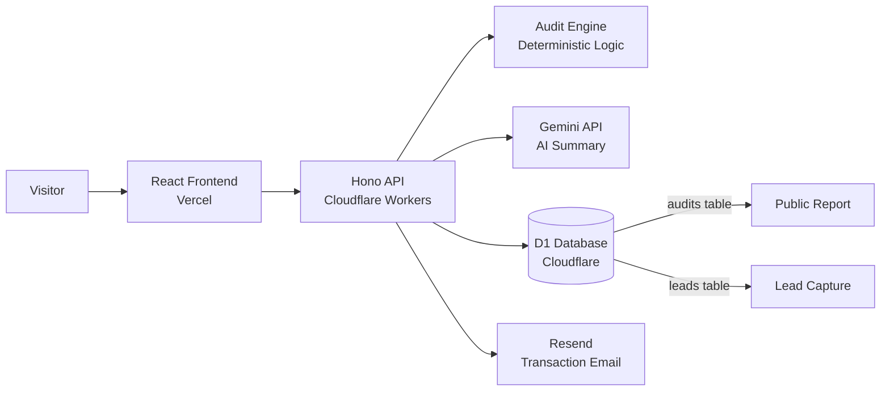

# Architecture

## System Diagram



## Data Flow

```
1. User fills form on frontend
2. Frontend sends POST /audit with { tools, teamSize, useCase }
3. Hono validates request body (Zod)
4. Audit engine runs deterministic logic (no AI)
5. Results saved to D1 (audits table)
6. AI summary generated via Gemini (with fallback)
7. Response returned to frontend
8. User sees results → optionally enters email
9. POST /lead saves email to D1 → Resend sends confirmation
10. User shares public report URL → GET /report/:publicId
```

## Stack Choices

| Layer | Choice | Why |
|-------|--------|-----|
| Frontend | React + Vite + TypeScript | Fast dev, strong typing |
| Styling | Tailwind v4 + shadcn/ui | Rapid UI, accessible primitives |
| State | Zustand + TanStack Query | Minimal boilerplate |
| Backend | Cloudflare Workers + Hono | Serverless, global, simple routing |
| Database | Cloudflare D1 (raw SQL) | Serverless SQLite, no ORM complexity |
| AI | Gemini API (swap to Anthropic) | Instant free access, preferred vendor |
| Email | Resend | Free tier, simple API |
| CI/CD | GitHub Actions | Runs tests on push to main |

## Scaling to 10k Audits/Day

- Add rate limiting at the Worker level
- Add caching for public report URLs (Cloudflare Cache API)
- Migrate from D1 to a dedicated SQL database (Postgres via Neon)
- Add request queuing for AI summary generation
- Add database read replicas for public reports
