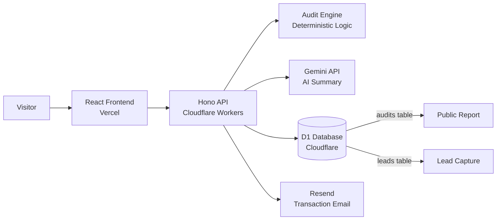

# Architecture

## Folder Structure

```
costpilot/
│
├── apps/
│   ├── costpilot-api/                  # Backend — Cloudflare Worker + Hono
│   │   ├── migrations/
│   │   │   └── 0001_001_create_tables.sql
│   │   ├── src/
│   │   │   ├── routes/                 # ONLY route definitions. NO logic.
│   │   │   │   ├── audit.ts            #   POST /audit
│   │   │   │   ├── lead.ts             #   POST /lead
│   │   │   │   └── report.ts           #   GET /report/:publicId
│   │   │   │
│   │   │   ├── controllers/            # ALL business logic. Handles req/res.
│   │   │   │   ├── audit.ts            #   Orchestrates engine + summary + DB
│   │   │   │   ├── audit-engine.ts     #   Pure logic: pricing rules (NO DB/API)
│   │   │   │   ├── lead.ts             #   Save email to D1
│   │   │   │   ├── report.ts           #   Fetch public report
│   │   │   │   └── summary.ts          #   Gemini API call + fallback
│   │   │   │
│   │   │   ├── db/                     # ONLY raw SQL queries. NO logic.
│   │   │   │   └── queries.ts          #   insertAudit, getAuditByPublicId, insertLead
│   │   │   │
│   │   │   ├── middleware/             # Hono middleware
│   │   │   │   └── rate-limit.ts       #   In-memory rate limiter (10 req/min)
│   │   │   │
│   │   │   ├── utils/                  # Shared helpers
│   │   │   │
│   │   │   ├── __tests__/              # Vitest tests
│   │   │   │   ├── env.d.ts
│   │   │   │   ├── index.test.ts       # Route tests
│   │   │   │   ├── audit-engine.test.ts
│   │   │   │   └── summary.test.ts
│   │   │   │
│   │   │   └── index.ts               # Entry point. Registers all routes.
│   │   │
│   │   ├── .dev.vars                  # Local secrets (gitignored)
│   │   ├── vitest.config.ts
│   │   ├── wrangler.jsonc             # Cloudflare config + D1 binding
│   │   ├── tsconfig.json
│   │   └── package.json
│   │
│   └── costpilot-web/                  # Frontend — React + Vite + Tailwind
│       └── src/                        # (frontend not yet built)
│
├── packages/
│   └── shared/
│       └── src/index.ts                # Types shared by frontend + backend
│
├── .github/workflows/
│   └── ci.yml                          # Runs pnpm test on push to main
│
├── docs/                               # Internal docs
├── CLAUDE.md                           # AI operating instructions
├── ARCHITECTURE.md                     # This file
├── DEVLOG.md                           # Daily dev log (assignment)
├── TESTS.md                            # Test list (assignment)
├── PRICING_DATA.md                     # Pricing sources (assignment)
├── PROMPTS.md                          # AI prompts (assignment)
└── README.md                           # Project overview (assignment)
```

---

## Route → Controller → DB Pattern

```
Route (routes/*.ts)
  │
  ├── Defines path + HTTP method
  ├── Attaches Zod validation middleware
  └── Passes request to controller function
  │
  ▼
Controller (controllers/*.ts)
  │
  ├── Receives Hono context (typed as `any`)
  ├── Reads validated data via c.req.valid("json")
  ├── Reads env bindings via c.env.*
  ├── Calls other controllers for pure logic
  ├── Calls db/queries for data access
  └── Returns response via c.json()
  │
  ▼
DB Queries (db/queries.ts)
  │
  ├── Raw SQL only
  ├── Prepared statements (no injection)
  └── Returns plain objects
```

### Rules

1. **Routes NEVER contain logic.** They only define path, middleware, and controller.
2. **Controllers handle everything** — validation reading, business logic, DB calls, response.
3. **Controllers use `any` type** for the Hono context. No fighting TypeScript.
4. **DB queries are raw SQL only.** No ORM, no logic.
5. **Pure logic lives in separate controllers** (e.g. `audit-engine.ts`) with no DB/env access.

---

## System Diagram



## Data Flow

```
1. User fills form on frontend
2. Frontend sends POST /audit with { tools, teamSize, useCase }
3. Hono validates request body (Zod)
4. Audit engine runs deterministic logic (no AI)
5. Results saved to D1 (audits table)
6. AI summary generated via Gemini (with fallback)
7. Response returned to frontend
8. User sees results → optionally enters email
9. POST /lead saves email to D1 → Resend sends confirmation
10. User shares public report URL → GET /report/:publicId
```

## Stack Choices

| Layer | Choice | Why |
|-------|--------|-----|
| Frontend | React + Vite + TypeScript | Fast dev, strong typing |
| Styling | Tailwind v4 + shadcn/ui | Rapid UI, accessible primitives |
| State | Zustand + TanStack Query | Minimal boilerplate |
| Backend | Cloudflare Workers + Hono | Serverless, global, simple routing |
| Database | Cloudflare D1 (raw SQL) | Serverless SQLite, no ORM complexity |
| AI | Gemini API (swap to Anthropic) | Instant free access, preferred vendor |
| Email | Resend | Free tier, simple API |
| CI/CD | GitHub Actions | Runs tests on push to main |

## Scaling to 10k Audits/Day

- Add rate limiting at the Worker level
- Add caching for public report URLs (Cloudflare Cache API)
- Migrate from D1 to a dedicated SQL database (Postgres via Neon)
- Add request queuing for AI summary generation
- Add database read replicas for public reports
