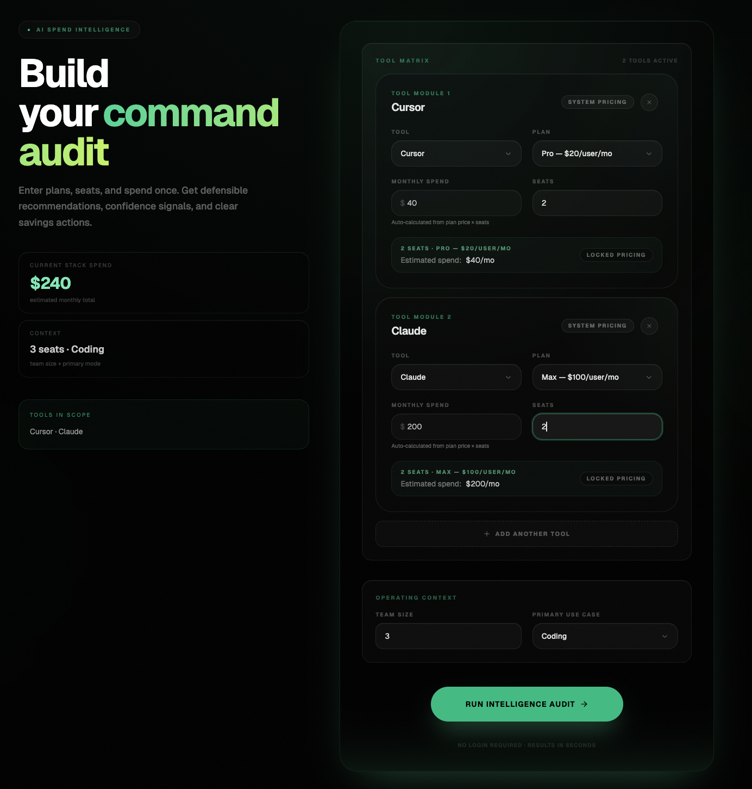
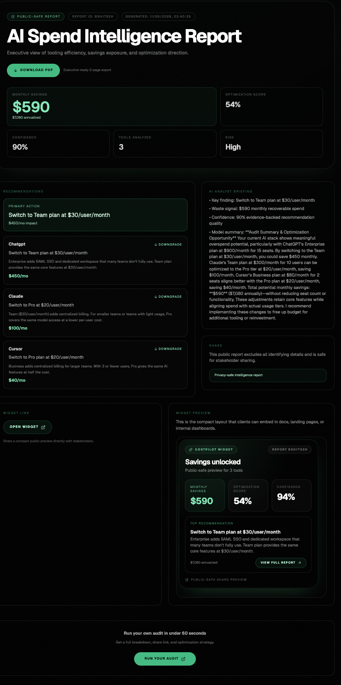
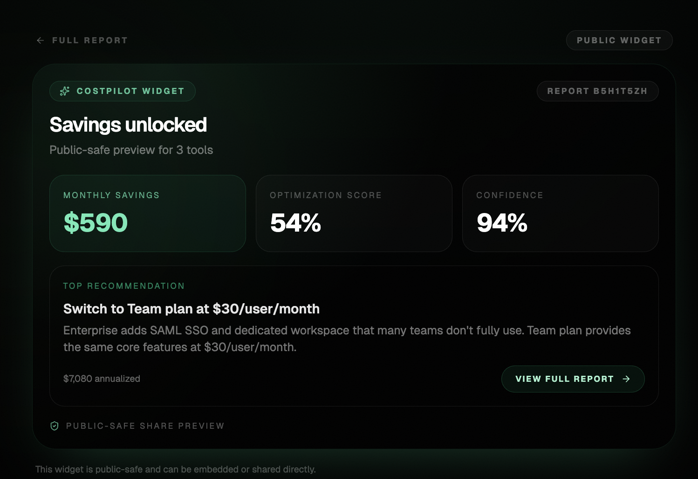

# CostPilot

**Audit your AI tooling spend. Find savings. Get recommended actions.**

CostPilot is a free web app that analyzes your team's AI tool subscriptions (Cursor, GitHub Copilot, Claude, ChatGPT, Anthropic API, OpenAI API, Gemini, and Windsurf) and tells you exactly where you're overspending—with defensible, actionable recommendations backed by current vendor pricing.

Built for the [Credex](https://www.credex.ai/) Round 1 assignment.

---

## Live Demo

**Frontend (Vercel):** https://costpilot-costpilot-web.vercel.app/

**Backend API (Cloudflare Workers):** https://costpilot-api.omshuklalko3.workers.dev/

Try the audit form now. No email required upfront.

---

## Key Features

✅ **Instant Audit** — Input your team's tools, plans, and spend. Get results in seconds.

✅ **Honest Recommendations** — Deterministic logic based on real vendor pricing (not guesses). Supports all 8 major AI tools.

✅ **AI Summary** — LLM-generated analysis of your audit (with graceful fallback if API is down).

✅ **Public Reports** — Share your audit results with your team via public URL. Report strips identifying info (email, company name) for privacy.

✅ **PDF Export** — Download your audit as an executive-grade PDF report.

✅ **Embeddable Widget** — Embed your audit results on your own website with an iframe snippet.

✅ **Benchmark Mode** — See how your team's spend, efficiency, and savings potential compare to similar teams.

✅ **19 Passing Tests** — Deterministic audit engine tested with 19 unit + integration tests.

---

## Screenshots

### 1. Audit Form
*User inputs team size, tools, plans, and monthly spend. Form auto-calculates totals and shows team configuration.*



### 2. Audit Results
*The core magic: Savings hero, primary recommendation, secondary opportunities, AI briefing, and optimization score.*



### 3. Embeddable Widget
*Executive-grade public report with audit metadata, recommendations, and CTAs. Also available as PDF export and embedded widget.*



---

## Tech Stack

### Frontend
- **React 18** + Vite (fast bundling)
- **TypeScript** (strict mode)
- **Tailwind CSS v4** + **shadcn/ui** (component library)
- **Zustand** (state management + persistence)
- **TanStack Query** (server state + caching)
- **Framer Motion** (premium animations)
- **React Router v6** (SPA routing)
- **React Hook Form** + **Zod** (form validation)
- **@react-pdf/renderer** (client-side PDF export)

### Backend
- **Cloudflare Workers** (serverless compute)
- **Hono** (lightweight HTTP framework)
- **D1** (SQLite database)
- **Raw SQL** (prepared statements, no ORM)
- **Vitest** (unit + integration tests)
- **Zod** (request validation + schema validation)
- **Resend** (transactional email)

### Infrastructure
- **Frontend deployed:** Vercel (auto-deploy from `main`)
- **Backend deployed:** Cloudflare Workers (auto-deploy from `main`)
- **Database:** Cloudflare D1 (SQLite, APAC region)
- **Email:** Resend (free tier, custom domain DNS verified)

---

## Quick Start

### Prerequisites
- Node.js 18+
- `pnpm` (or `npm`/`yarn`)
- Cloudflare account (for local D1 setup)

### Local Development

```bash
# Install dependencies
pnpm install

# Backend
cd apps/costpilot-api
pnpm dev
# Runs on http://localhost:8787

# Frontend (in another terminal)
cd apps/costpilot-web
pnpm dev
# Runs on http://localhost:5173
```

### Running Tests

```bash
# Run all tests
pnpm test

# Watch mode
pnpm test --watch

# Coverage (backend)
cd apps/costpilot-api
pnpm test -- --coverage
```

Expected: **19 tests passing** (12 audit engine, 5 summary fallback, 2 route tests)

### Deploying

**Frontend (Vercel):**
```bash
git push origin main
# Auto-deploys to https://costpilot-costpilot-web.vercel.app/
```

**Backend (Cloudflare Workers):**
```bash
cd apps/costpilot-api
wrangler deploy
# Auto-deploys to https://costpilot-api.omshuklalko3.workers.dev/
```

---

## Architecture

See [ARCHITECTURE.md](./ARCHITECTURE.md) for full technical design.

**Core pattern:** Routes → Controllers → DB

- **Routes** handle HTTP (validation, response codes)
- **Controllers** handle business logic (audit engine, summary generation)
- **DB queries** are pure SQL (no ORM)

**Audit engine** is pure, deterministic logic (no randomness, no API calls). Can be tested in isolation.

---

## API Endpoints

### `POST /audit`
**Input:** Team size, tools (with plans), monthly spend per tool, use case

**Output:** Recommendations array, total monthly/yearly savings, AI summary text

**Example:**
```bash
curl -X POST https://costpilot-api.omshuklalko3.workers.dev/audit \
  -H "Content-Type: application/json" \
  -d '{
    "teamSize": 10,
    "tools": [
      { "id": "cursor", "plan": "business", "monthlySpend": 400, "seats": 10 },
      { "id": "chatgpt", "plan": "team", "monthlySpend": 300, "seats": 10 }
    ],
    "useCase": "coding"
  }'
```

**Response:**
```json
{
  "id": "0GD0DByO4WNP",
  "tools": [...],
  "recommendations": [
    {
      "type": "plan-downgrade",
      "tool": "cursor",
      "action": "Downgrade 8 seats from Business to Pro",
      "currentCost": 400,
      "newCost": 160,
      "monthlySavings": 240,
      "confidence": "high"
    }
  ],
  "totalMonthlySavings": 240,
  "totalYearlySavings": 2880,
  "summary": "You can optimize your AI tool spend by downgrading Cursor...",
  "summarySource": "deepseek",
  "createdAt": "2026-05-12T12:10:49.912+05:30"
}
```

See [API_CONTRACTS.md](./docs/API_CONTRACTS.md) for full spec.

---

## Testing

### Audit Engine Tests (12 tests)
- Downgrade logic for Cursor, Copilot, ChatGPT, Claude, Windsurf, Gemini
- Credit optimization for API spend
- Already-optimal detection
- Alternative tool recommendations
- Multi-tool savings aggregation

### Summary Fallback Tests (5 tests)
- Fallback when API key missing
- Fallback when API fails
- Inclusion of dollar amounts
- Honest messaging for low/zero savings

### Route Tests (2 tests)
- POST /audit validates input and returns 200
- Unknown routes return 404

**Run tests:**
```bash
pnpm test
```

Expected output: **19 passed** ✅

---

## Key Decisions

1. **Raw SQL over ORM** — Simpler D1 setup, fewer dependencies, explicit queries.
2. **DeepSeek API** (was Gemini) — Faster API calls, graceful fallback if quota exceeded.
3. **Deterministic audit engine** — Pure logic, no randomness, fully testable.
4. **No auth** — Assignment requires frictionless onboarding. Email captured after value shown.
5. **Frontend-first UX** — Premium animations and polish to feel "startup-grade."

See [ARCHITECTURE.md](./ARCHITECTURE.md) for full rationale.

---

## Pricing Data

All pricing verified against official vendor sources. See [PRICING_DATA.md](./PRICING_DATA.md) for full pricing table and verification dates.

- **Cursor:** $0 (Hobby), $20/mo (Pro), $40/mo (Business)
- **GitHub Copilot:** $10/mo (Individual), $39/mo (Business)
- **Claude:** $0 (Free), $20/mo (Pro), $30/user/mo (Team)
- **ChatGPT:** $20/mo (Plus), $30/user/mo (Team)
- **Anthropic API:** $0.80–$15 per million input tokens
- **OpenAI API:** $0.15–$15 per million input tokens
- **Gemini:** Free, $19.99/mo (Pro), API at per-token pricing
- **Windsurf:** Free, $15/mo (Pro), $35/user/mo (Teams)

---

## Documentation

- **[ARCHITECTURE.md](./ARCHITECTURE.md)** — Technical design, patterns, rules
- **[DEVLOG.md](./DEVLOG.md)** — Daily work log (7 entries across 6 days)
- **[TESTS.md](./TESTS.md)** — Test coverage and how to run
- **[PRICING_DATA.md](./PRICING_DATA.md)** — All pricing sources verified
- **[PROMPTS.md](./PROMPTS.md)** — AI summary prompt + fallback template
- **[GTM.md](./GTM.md)** — Go-to-market strategy (target user, channels, first 100 users)
- **[ECONOMICS.md](./ECONOMICS.md)** — Unit economics ($1M ARR model)
- **[METRICS.md](./METRICS.md)** — North Star metric, instrumentation plan
- **[REFLECTION.md](./REFLECTION.md)** — Process reflection, decisions, self-assessment

---

## Contributing

This is a Credex Round 1 assignment submission. Not accepting external contributions at this time.

---

## License

MIT

---

## Contact

**Built by:** Omshukla (omshukladev)

**Questions?** Open an issue or reach out via X/Twitter.

